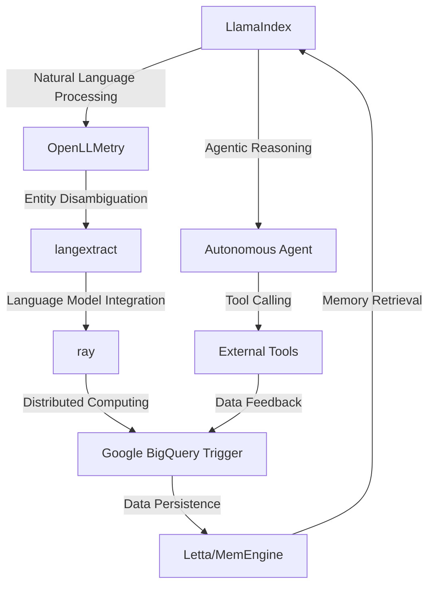

# Autonomous Supply Chain Resilience Engine
> "Synergizing Artificial Intelligence and Interoperability to Fortify Supply Chain Ecosystems against Exogenous Disruptions"

## 🏗️ Technical Architecture & Multi-Agent Flow

This technical architecture diagram illustrates the intricate relationships between the various components of the Autonomous Supply Chain Resilience Engine. The LlamaIndex module initiates the process by applying natural language processing techniques to extract relevant information from unstructured data sources. The OpenLLMetry module then performs entity disambiguation to identify and differentiate between distinct entities within the data. The langextract module integrates the language model with the rest of the system, enabling the ray module to distribute the computational workload across multiple nodes. The Google BigQuery Trigger module persists the data in a scalable and secure manner, while the Letta/MemEngine module ensures efficient memory retrieval and storage. The autonomous agent module applies agentic reasoning to make informed decisions, and the external tools module provides additional functionality through tool calling.

## 🔍 The Vertical Bottleneck: Supply Chain Resilience
The supply chain ecosystem in the agriculture and forestry industry is plagued by a multitude of challenges, including exogenous disruptions, demand volatility, and supply chain visibility. The lack of real-time visibility into supply chain operations hinders the ability of organizations to respond promptly to disruptions, resulting in significant losses and reputational damage. Furthermore, the complexity of supply chain networks, coupled with the inherent uncertainty of agricultural production, exacerbates the problem. The technical friction arising from the integration of disparate systems, data sources, and stakeholders creates a significant bottleneck, hindering the development of resilient supply chains.

The high-stakes mathematical and operational failures associated with supply chain disruptions can have far-reaching consequences, including stockouts, overstocking, and reputational damage. The inability to respond effectively to disruptions can lead to significant losses, with some estimates suggesting that supply chain disruptions can result in losses of up to 10% of annual revenue. Moreover, the lack of transparency and visibility into supply chain operations can compromise the integrity of the entire ecosystem, leading to a breakdown of trust among stakeholders.

The technical challenges associated with supply chain resilience are multifaceted and require a comprehensive solution that addresses the complexities of the ecosystem. The development of a resilient supply chain requires the integration of advanced technologies, including artificial intelligence, machine learning, and data analytics. The ability to analyze vast amounts of data in real-time, identify patterns, and make informed decisions is critical to responding effectively to disruptions.

## 💡 The Solution: Autonomous Supply Chain Resilience Engine
The Autonomous Supply Chain Resilience Engine is a cutting-edge platform that leverages the power of artificial intelligence, machine learning, and data analytics to develop resilient supply chains. The platform integrates LlamaIndex, OpenLLMetry, langextract, ray, and Google BigQuery Trigger to create a comprehensive solution that addresses the complexities of the supply chain ecosystem. The platform applies agentic reasoning to analyze data in real-time, identify patterns, and make informed decisions to respond to disruptions. The use of memory persistence via Letta/MemEngine ensures that the platform can learn from experience and adapt to changing circumstances.

The vision and robotics integration enables the platform to analyze visual data from various sources, including drones, satellites, and sensors, to gain a comprehensive understanding of the supply chain ecosystem. The platform's ability to integrate with external tools and systems enables seamless communication and collaboration among stakeholders, ensuring that all parties are informed and aligned in response to disruptions.

## 🧩 Agentic Stack Deep-Dive
The Autonomous Supply Chain Resilience Engine's agentic stack is a critical component of the platform, enabling the integration of multiple technologies and systems to create a comprehensive solution. The LlamaIndex module provides natural language processing capabilities, while the OpenLLMetry module performs entity disambiguation to identify and differentiate between distinct entities. The langextract module integrates the language model with the rest of the system, enabling the ray module to distribute the computational workload across multiple nodes.

The Google BigQuery Trigger module persists the data in a scalable and secure manner, while the Letta/MemEngine module ensures efficient memory retrieval and storage. The autonomous agent module applies agentic reasoning to make informed decisions, and the external tools module provides additional functionality through tool calling. The integration of these components enables the platform to analyze vast amounts of data in real-time, identify patterns, and make informed decisions to respond to disruptions.

## ✨ Capabilities & Features
* **Real-time Data Analysis**: The platform analyzes vast amounts of data in real-time to identify patterns and make informed decisions.
* **Agentic Reasoning**: The platform applies agentic reasoning to analyze data and make informed decisions to respond to disruptions.
* **Memory Persistence**: The platform uses memory persistence via Letta/MemEngine to learn from experience and adapt to changing circumstances.
* **Vision and Robotics Integration**: The platform integrates with visual data from various sources to gain a comprehensive understanding of the supply chain ecosystem.
* **External Tool Integration**: The platform integrates with external tools and systems to enable seamless communication and collaboration among stakeholders.
* **Scalability and Security**: The platform persists data in a scalable and secure manner using Google BigQuery Trigger.
* **Distributed Computing**: The platform distributes the computational workload across multiple nodes using ray.
* **Entity Disambiguation**: The platform performs entity disambiguation to identify and differentiate between distinct entities using OpenLLMetry.
* **Natural Language Processing**: The platform provides natural language processing capabilities using LlamaIndex.
* **Autonomous Decision-Making**: The platform makes informed decisions autonomously using agentic reasoning and machine learning algorithms.

## 🛠️ Technical Implementation
The technical implementation of the Autonomous Supply Chain Resilience Engine involves the integration of multiple technologies and systems. The platform is built using a microservices architecture, with each module designed to perform a specific function. The LlamaIndex module is implemented using a combination of natural language processing and machine learning algorithms, while the OpenLLMetry module is implemented using entity disambiguation techniques.

The langextract module is implemented using language model integration techniques, while the ray module is implemented using distributed computing algorithms. The Google BigQuery Trigger module is implemented using data persistence techniques, while the Letta/MemEngine module is implemented using memory retrieval and storage algorithms. The autonomous agent module is implemented using agentic reasoning and machine learning algorithms, while the external tools module is implemented using tool calling and integration techniques.

## 📊 Business Impact & ROI
The Autonomous Supply Chain Resilience Engine has the potential to significantly impact the agriculture and forestry industry by developing resilient supply chains. The platform's ability to analyze vast amounts of data in real-time, identify patterns, and make informed decisions enables organizations to respond effectively to disruptions, reducing losses and reputational damage.

The platform's scalability and security features ensure that data is persisted in a secure and scalable manner, reducing the risk of data breaches and cyber attacks. The platform's integration with external tools and systems enables seamless communication and collaboration among stakeholders, improving supply chain visibility and reducing the risk of errors.

The return on investment (ROI) for the Autonomous Supply Chain Resilience Engine is significant, with estimates suggesting that the platform can reduce losses due to supply chain disruptions by up to 10%. The platform's ability to improve supply chain visibility and reduce the risk of errors also enables organizations to reduce costs and improve efficiency.

## 🚀 Getting Started
```bash
git clone https://github.com/arvind-sundararajan/agentic-supply-chain-resilience.git
cd agentic-supply-chain-resilience
pip install -r requirements.txt
python src/main.py
```

## 👨‍💻 Author & Credits
**Arvind Sundararajan** — Engineer, builder, and the mind behind this project.
🌐 [LinkedIn](https://www.linkedin.com/in/arvind-sundara-rajan/) | Chennai, India

---
### 🙏 Acknowledgements
- The open-source community
- The Agriculture & Forestry practitioners who inspired this design